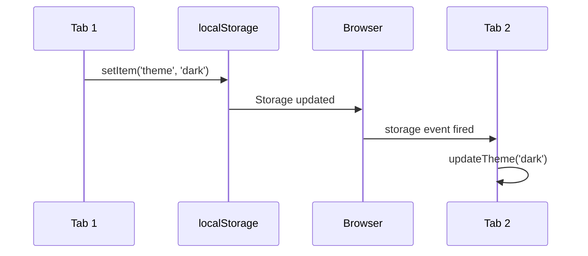

Have you ever wanted to sync state between browser tabs? Maybe you're building a theme switcher, a shopping cart, or a settings panel and you want changes in one tab to show up in all other open tabs.

Most developers know about localStorage. You can save data, read it back, and it stays there even after closing the browser. 

But here's something that exists in browsers that many developers know about but don't really use: the storage event. The browser automatically fires this event when localStorage changes in another tab or window at the same origin.

Its a simple way to sync state across tabs. Let me show you how it works.

## How It Works

Say you have a theme toggle in your app. A user opens your site in two tabs. They change the theme in tab one. With the storage event, tab two can automatically update to show the new theme.

The browser fires a storage event when localStorage changes in another tab or window at the same origin. You just need to listen for it:

```javascript
addEventListener('storage', (event) => {
  if (event.key === 'theme') {
    updateTheme(event.newValue)
  }
})
```

When another tab updates localStorage, this event fires in all other tabs at the same origin. You can sync your state across tabs without any complex setup.

Here's how the flow looks:



## One Thing to Remember

The storage event only fires in other tabs, not the tab that made the change. This is by design. So if you update localStorage in the current tab, you need to handle that update yourself. The storage event handles the cross tab sync but not the same tab update.

<div class="note">

**Note:** Make sure your page is served over HTTP or HTTPS. If you're testing locally with `file:///` protocol the storage event wont fire. Use a local dev server instead.

</div>

Here's a complete example:

```javascript
function updateTheme(newTheme) {
  document.body.className = newTheme
}

// Listen for storage changes from other tabs
addEventListener('storage', (event) => {
  if (event.key === 'theme') {
    updateTheme(event.newValue)
  }
})

function toggleTheme() {
  const newTheme = localStorage.getItem('theme') === 'dark' ? 'light' : 'dark'
  localStorage.setItem('theme', newTheme)
  updateTheme(newTheme) // Update current tab manually
}
```

## Using It in React

If you're using React, you can use useSyncExternalStore to sync with localStorage. This keeps your React state in sync with localStorage across all tabs:

```javascript
function subscribe(callback) {
  const handler = (e) => {
    if (e.key === 'theme') callback()
  }
  addEventListener('storage', handler)
  return () => removeEventListener('storage', handler)
}

function getSnapshot() {
  return localStorage.getItem('theme') || 'dark'
}

const theme = useSyncExternalStore(subscribe, getSnapshot)
```

Now whenever the theme changes in another tab, your React component will re-render with the new value. Pretty neat right?

<div class="note">

**Note:** You could do this with useEffect and useState too. It would work fine for most cases. useSyncExternalStore is just Reacts way of subscribing to external stores like localStorage. It handles some edge cases around concurrent rendering that you probably wont run into, but its the "proper" way to do it if you want to follow React patterns. Not strictly needed but good to know about.

</div>

## When to Use What

Use the storage event when you're already using localStorage and just need simple sync across tabs. Its built into browsers and works well. The storage event is just less known which is why many apps don't sync state across tabs even though they could.

## One More Thing: BroadcastChannel API

There's also the BroadcastChannel API if you need more control over the messaging between tabs. It has good browser support now (around 95% global support) and lets you send any kind of messages between tabs at the same origin. Its more flexible than the storage event but also requires you to handle the messaging yourself. I might write about it in a future post.

## Wrapping Up

The storage event is a simple built-in way to sync state across browser tabs. Its perfect for syncing localStorage changes and you dont need any extra libraries or complex setup. Next time you need to sync state between tabs, give it a try.

What do you use the storage event for? Let me know!
